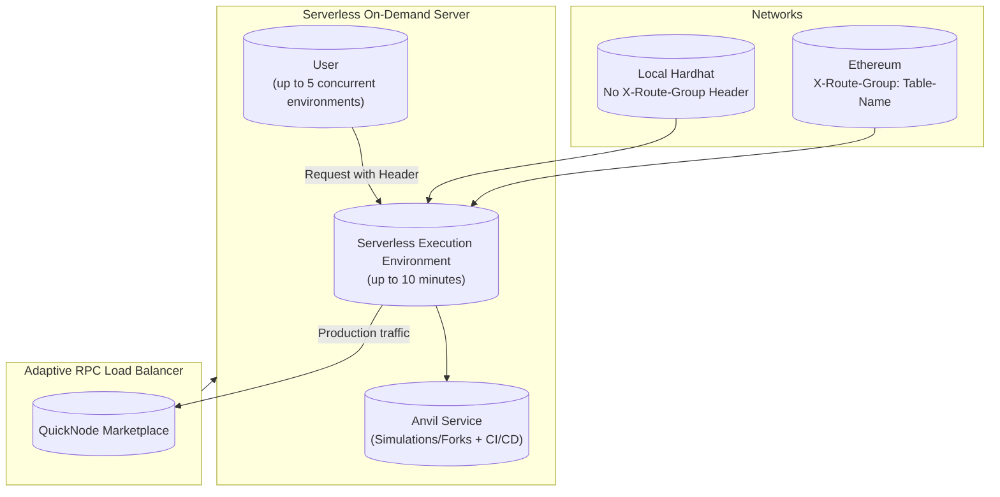

# Serverless

### Anvil EVM Sim Environment on Demand

## Free Beta Access:

During beta testing we're offering free access to our serverless on-demand anvil execution environments,
which you can use to run Tx simulations or smart contract CI/CD. Not to mention, while also even load balancing
your production traffic through our Adaptive RPC Load Balancer on QuickNode Marketplace, truly all in one.

#### Requires Adaptive RPC Load Balancer Sign Up on QuickNode Marketplace.

## Overview:

A serverless on-demand server that you can use your QuickNode, other providers, or even your own self-managed endpoints
to run Tx simulations, smart contract CI/CD, while also even load balancing your production traffic through our Adaptive
RPC Load Balancer on QuickNode Marketplace, truly all in one.

- Each serverless execution environment lasts for up to 10 minutes max, but you can end early to release
- Each environment contains an anvil service you can use for simulations/forks + automated smart contract ci/cd
- Each user during beta can run up to 5 concurrent serverless execution environments for free.

## Serverless Sessions

You need to add a header with a unique session-id name of your choice, per each concurrent serverless environment

    SERVERLESS_HEADER
        KEY: X-Anvil-Session-Lock-ID
        VALUE: 0 characters < ANY string < 256 characters

    NETWORKS:
        LOCAL_HARDHAT: Don't add X-Route-Group
        
        ETHEREUM: 
            KEY: X-Route-Group
            VALUE: Table-Name (eg. ethereum-mainnet)

## Demo

What we show in under 60 seconds:

##### Creating a local hardhat serverless session (no X-Route-Group header)

- Calls chain id to confirm local hardhat session

##### Creating an ethereum serverless session (with X-Route-Group header)

- Using a pinned block number
- Using latest block number

##### How to use the load balancer with your serverless session

- Using your pre-existing routing table header (eg. ethereum-mainnet)

##### How to end your serverless session

- By using X-End-Session-Lock-ID header with your session-id

<iframe width="1000" height="700" src="https://www.youtube.com/embed/KXkFGW4DGPU?si=ESiYQWXlCj0g4Oqe" title="YouTube video player" frameborder="0" allow="accelerometer; autoplay; clipboard-write; encrypted-media; gyroscope; picture-in-picture; web-share" allowfullscreen></iframe>

### Top Reason to Use the Adaptive RPC Load Balancer?

There's many, but the top one? People are sick of hitting 429 rate limiting and 5xx errors. What's double worse is
paying for the request that failed. So we set out to solve this problem.

Now there's a solution, backed by extensive studies. Turn many endpoints into one super endpoint that handles the scale
you need without the errors. It can handle Nx more requests with N being the number of requests/sec than any single
endpoint can handle. That's in addition to the other significant proven performance gains and error rate reductions you
can expect from our adaptive load balancing technology, see our benchmarking section for details.