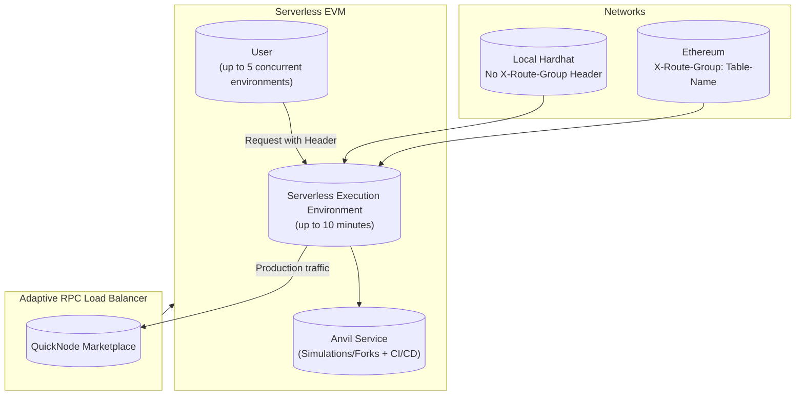

# Serverless EVM

### Foundry's Anvil as an EVM Sim Environment on Demand

## Overview

Serverless EVM environments that you can use your QuickNode, other providers, or even your own self-managed endpoints
to run Tx simulations, smart contract CI/CD, while also even load balancing your production traffic through our Adaptive
RPC Load Balancer on QuickNode Marketplace.

- Each serverless execution environment lasts for up to 10 minutes max, but you can end early to release.
- Each environment contains an anvil service you can use for simulations/forks + automated smart contract CI/CD.
- Each user during beta can run up to 5 concurrent serverless execution environments for free.
- It will automatically convert `hardhat_` prefixed rpc methods to the equivalent `anvil_` method.
- Integrated Go web3 client under `pkg/artemis/web3/client` on our GitHub repo.
- We disabled the embedded Anvil rate limiter, so you can use at full speed. `NO_RATE_LIMITS=true`



## Serverless Sessions

You need to add a header with a unique session-id name of your choice, per each concurrent serverless environment.

    SERVERLESS_HEADER
        KEY: X-Anvil-Session-Lock-ID
        VALUE: 0 characters < ANY string < 256 characters

    NETWORKS:
        LOCAL_HARDHAT: Don't add X-Route-Group
        
        ETHEREUM: 
            KEY: X-Route-Group
            VALUE: Table-Name (eg. ethereum-mainnet)

## What we show in under 60 seconds...

### Creating a local hardhat serverless session (no X-Route-Group header)

- Calls `eth_chainId` to confirm local hardhat session

```curl
curl --location 'https://iris.zeus.fyi/v1/router' \
--header 'X-Anvil-Session-Lock-ID: local-hardhat-env' \
--header 'Content-Type: application/json' \
--header 'Authorization: Bearer BEARER' \
--data '{
    "jsonrpc": "2.0",
    "method": "eth_chainId",
    "params": [],
    "id": 1
}' 
```

### Creating a mainnet serverless session (with X-Route-Group header)

- Adds `X-Route-Group: ethereum-mainnet` header to the request
- Creates a second serverless session with a different `X-Anvil-Session-Lock-ID` header

```curl
curl --location 'https://iris.zeus.fyi/v1/router' \
--header 'X-Anvil-Session-Lock-ID: test-fork-mainnet' \
--header 'X-Route-Group: ethereum-mainnet' \
--header 'Content-Type: application/json' \
--header 'Authorization: Bearer BEARER' \
--data '{
    "jsonrpc": "2.0",
    "method": "eth_chainId",
    "params": [],
    "id": 1
}' 
```

### Creating an ethereum serverless session (with X-Route-Group header)

#### Using a pinned block number

```json
{
  "jsonrpc": "2.0",
  "method": "anvil_reset",
  "params": [
    {
      "forking": {
        "jsonRpcUrl": "http://localhost:8545",
        "blockNumber": 14390000
      }
    }
  ],
  "id": 1
}
```

#### Using latest block number

```json
{
  "jsonrpc": "2.0",
  "method": "anvil_reset",
  "params": [
    {
      "forking": {
        "jsonRpcUrl": "http://localhost:8545"
      }
    }
  ],
  "id": 1
}
```

#### Calls get block number to confirm session

```json

{
  "jsonrpc": "2.0",
  "method": "eth_blockNumber",
  "params": [],
  "id": 1
}
```

#### How to use the load balancer with your serverless session

- Using your pre-existing routing table header (eg. ethereum-mainnet)

#### How to end your serverless session

Either way works. We prefer the first way.

- By using a `DELETE` request to `https://iris.zeus.fyi/v1/serverless/{session-id}`
- By using a `X-End-Session-Lock-ID` header with your `X-Anvil-Session-Lock-ID` value
## YouTube Walkthrough

<iframe width="1000" height="700" src="https://www.youtube.com/embed/KXkFGW4DGPU?si=ESiYQWXlCj0g4Oqe" title="YouTube video player" frameborder="0" allow="accelerometer; autoplay; clipboard-write; encrypted-media; gyroscope; picture-in-picture; web-share" allowfullscreen></iframe>

## Unit Testing Smart Contracts in Golang

Using the serverless sessions allows you to run smart contracts tests fully in parallel.

- Both tests shown below complete in ~1.6s

### How to use serverless sessions in your tests efficiently

Using a test name id + a unique id to prevent accidental session collisions. Then calling defer on releasing the session,
so you can use it for the next test.

```go
	sessionID := fmt.Sprintf("%s-%s", "local-network-session", uuid.New().String())
	w3a := CreateLocalUser(ctx, s.Tc.Bearer, sessionID)
	defer func(sessionID string) {
		err := w3a.EndAnvilSession()
		s.Require().Nil(err)
	}(sessionID)
```

### How to end the session on completion

#### Direct DELETE request

```text
DELETE https://iris.zeus.fyi/v1/serverless/{session-id}
```

#### Using the Go web3 client

```go
func (i *Iris) EndServerlessEnvironment(sessionID string) error {
	resp, err := i.R().
		Delete(fmt.Sprintf("/v1/serverless/%s", sessionID))
	if err != nil {
		log.Err(err).Msg("EndServerlessSession failed")
		return err
	}
	if resp.StatusCode() >= 400 {
		err = fmt.Errorf("EndServerlessSession: status code: %d", resp.StatusCode())
		log.Err(err).Msg("EndServerlessSession failed")
		return err
	}
	return nil
}
```

## Test Suite Setup

```go
const (
    LoadBalancerAddress = "https://iris.zeus.fyi/v1/router"
)

var ctx = context.Background()

type AdaptiveRpcLoadBalancerExamplesTestSuite struct {
    test_suites.BaseTestSuite
    Tc configs.TestContainer
}

func (s *AdaptiveRpcLoadBalancerExamplesTestSuite) SetupTest() {
// points dir to test/configs
    s.Tc = configs.InitLocalTestConfigs()
}

func CreateLocalUser(ctx context.Context, bearer, sessionID string) web3_actions.Web3Actions {
    acc, err := accounts.CreateAccount()
    if err != nil {
        panic(err)
    }
    w3a := web3_actions.NewWeb3ActionsClientWithAccount(LoadBalancerAddress, acc)
    w3a.AddAnvilSessionLockHeader(sessionID)
    w3a.AddBearerToken(bearer)
    nvB := (*hexutil.Big)(smart_contract_library.EtherMultiple(10000))
    w3a.Dial()
    defer w3a.Close()
    err = w3a.SetBalance(ctx, w3a.Address().String(), *nvB)
    if err != nil {
        panic(err)
    }
    return w3a
}

func TestAdaptiveRpcLoadBalancerExamplesTestSuite(t *testing.T) {
    suite.Run(t, new(AdaptiveRpcLoadBalancerExamplesTestSuite))
}
```

## Sets up a mintable contract

```go
func (s *AdaptiveRpcLoadBalancerExamplesTestSuite) setupMintToken(mintAmount *big.Int) (string, web3_actions.SendContractTxPayload) {
    // mintable contract
    abiDefAndByteCode := smart_contract_library.TokenJson
    m := make(map[string]interface{})
    err := json.Unmarshal([]byte(abiDefAndByteCode), &m)
    s.Assert().Nil(err)
    
    s.Require().NotNil(m["abi"])
    s.Require().NotNil(m["bytecode"])
    abiDef := m["abi"]
    
    abiBin, err := json.Marshal(abiDef)
    s.Assert().Nil(err)
    
    byteCode := m["bytecode"].(string)
    abiFile := signing_automation_ethereum.MustReadAbiString(ctx, string(abiBin))
    tokenPayload := web3_actions.SendContractTxPayload{
        SendEtherPayload: web3_actions.SendEtherPayload{
            GasPriceLimits: web3_actions.GasPriceLimits{
                GasLimit:  5000000,
                GasTipCap: big.NewInt(100000000),
                GasFeeCap: big.NewInt(1000000000 * 2),
        },
    },
        ContractABI: abiFile,
        Params:      []interface{}{mintAmount},
    }

    return byteCode, tokenPayload
}
```

### Deploys a mintable contract via pre-compiled binary string

```go
// TestDeployContractToHardhatLocalNetwork deploys an erc20 token contract that mints tokens to the deployer's account
func (s *AdaptiveRpcLoadBalancerExamplesTestSuite) TestDeployContractToHardhatLocalNetwork() {
    s.T().Parallel()
    sessionID := fmt.Sprintf("%s-%s", "local-network-session", uuid.New().String())
    w3a := CreateLocalUser(ctx, s.Tc.Bearer, sessionID)
    defer func (sessionID string) {
        err := w3a.EndAnvilSession()
        s.Require().Nil(err)
    }(sessionID)
    
    // deploy a contract with these params in the constructor, minting 10 million tokens to the deployer's account
    ether := big.NewInt(1e18)
    mintAmount := new(big.Int).Mul(big.NewInt(10000000), ether)
    
    pubkey := w3a.Address().String()
    etherBalance, err := w3a.GetBalance(ctx, pubkey, nil)
    s.Require().Nil(err)
    s.Require().NotZero(etherBalance.Int64())
    
    byteCode, tokenPayload := s.setupMintToken(mintAmount)
    tx, err := w3a.GetSignedDeployTxToCallFunctionWithArgs(ctx, byteCode, &tokenPayload)
    s.Require().Nil(err)
    s.Require().NotNil(tx)
    
    err = w3a.SendSignedTransaction(ctx, tx)
    s.Require().Nil(err)
    
    rx, err := w3a.GetTxReceipt(ctx, tx.Hash().String())
    s.Require().NotNil(rx)
    s.Require().Nil(err)
    
    scAddr := rx.ContractAddress.String()
    
    tokenBalance, err := w3a.ReadERC20TokenBalance(ctx, scAddr, w3a.Address().String())
    s.Require().Nil(err)
    s.Assert().NotZero(tokenBalance)
    s.Assert().Equal(mintAmount.String(), tokenBalance.String())
}
```

### Sends Ether to another user

```go
func (s *AdaptiveRpcLoadBalancerExamplesTestSuite) TestSendEther() {
    s.T().Parallel()
    sessionID := fmt.Sprintf("%s-%s", "local-network-send-ether", uuid.New().String())
    
    w3a := CreateLocalUser(ctx, s.Tc.Bearer, sessionID)
    defer func (sessionID string) {
        err := w3a.EndAnvilSession()
        s.Require().Nil(err)
    }(sessionID)
    ether := big.NewInt(1e18)
    
    pubkey := w3a.Address().String()
    etherBalance, err := w3a.GetBalance(ctx, pubkey, nil)
    s.Require().Nil(err)
    s.Require().NotZero(etherBalance.Int64())
    
    // send 1 ether to the 's account
    secondAcct := accounts.StringToAddress("0x70997970C51812dc3A010C7d01b50e0d17dc79C8")
    etherBalanceSecondAcct, err := w3a.GetBalance(ctx, secondAcct.String(), nil)
    s.Require().Nil(err)
    
    params := web3_actions.SendEtherPayload{
        TransferArgs: web3_actions.TransferArgs{
            Amount:    ether,
            ToAddress: secondAcct,
		},
            GasPriceLimits: web3_actions.GasPriceLimits{
            GasLimit:  21000,
            GasTipCap: big.NewInt(100000000),
            GasFeeCap: big.NewInt(1000000000 * 2),
		},
    }
    tx, err := w3a.Send(ctx, params)
    s.Require().Nil(err)
    s.Require().NotNil(tx)
    
    expBal := new(big.Int).Add(etherBalanceSecondAcct, ether)
    newBalSecondAcct, err := w3a.GetBalance(ctx, secondAcct.String(), nil)
    s.Require().Nil(err)
    s.Assert().Equal(expBal.String(), newBalSecondAcct.String())
}
```

## Top Reason to Use the Adaptive RPC Load Balancer?

There's many, but the top one? People are sick of hitting 429 rate limiting and 5xx errors. What's double worse is
paying for the request that failed. So we set out to solve this problem.

Now there's a solution, backed by extensive studies. Turn many endpoints into one super endpoint that handles the scale
you need without the errors. It can handle Nx more requests with N being the number of requests/sec than any single
endpoint can handle. That's in addition to the other significant proven performance gains and error rate reductions you
can expect from our adaptive load balancing technology, see our benchmarking section for details.