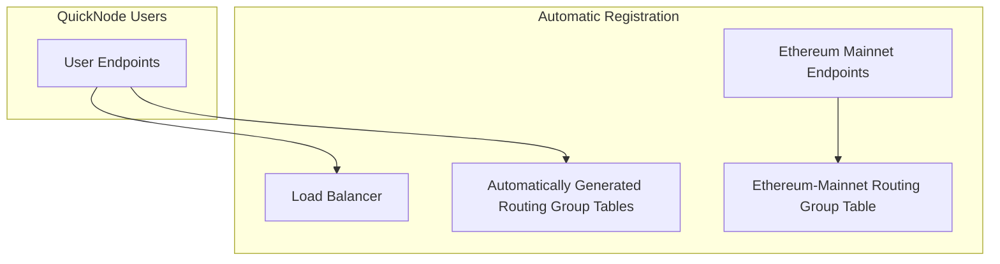

# Setup

## Top Reason to Use the Adaptive RPC Load Balancer?

There's many, but the top one? People are sick of hitting 429 rate limiting and 5xx errors. What's
double worse is paying for the request that failed. So we set out to solve this problem.

Now there's a solution, backed by extensive studies. Turn many endpoints into one super endpoint that handles the
scale you need without the errors. It can handle Nx more requests with N being the number of
requests/sec than any single endpoint can handle. That's in addition to the other significant proven performance gains
and error rate reductions you can expect from our adaptive load balancing technology, see our benchmarking section for
details.

## Free Mempool Access During Beta

During beta testing we're offering unlimited free access to our mempool service at a level which is comparable to:

- BloXroute - Enterprise/Enterprise-Elite ($1250-5000/mo)
- Blocknative - Growth1-Growth2 ($1250-5000/mo)

Don't wait. We'll be out of beta testing within the next couple of weeks, and free access will be gone forever.

# Sign Up

Sign up here:
https://marketplace.quicknode.com/add-on/zeusfyi-4

## Overview

We use ZU to denote Zeus compute units.
These units are derived from server bandwidth, cpu, memory usage and average and peak traffic usage, and operational
costs for development & maintenance.

<b>4 ZU</b> per request & response.<br/>
<b>1 ZU</b> per 1 kB<br/><br/>
<b>10 ZU minimum for round trip request </b><br/><br/>

Each user can store up to 1000 endpoints for free, you can then use these endpoints to create routing group tables via
API or UI Dashboard

## 1-on-1 Onboarding

Want one-on-one help getting started? Schedule a Google meet with an expert
at [https://calendly.com/zeusfyi/solutions-engineering](https://calendly.com/zeusfyi/solutions-engineering)

## QuickNode Marketplace Users

QuickNode marketplace customers will use an SSO link from QuickNode and be directed to their load balancing stored
endpoints table, you'll then be able to generate an API key from the access panel.



### Additional Benefits:

QuickNode users will have their endpoints automatically registered with the load balancer, and will have automatically
generated routing group tables based on the network-chain type for that endpoint. E.g. ethereum mainnet endpoints will
be automatically registered to the ethereum-mainnet routing group table. These won't count against your
routing table limits unless you make any manual changes to them.

Need more? Send us a message at support@zeus.fyi

## API Key Setup

This is a guide to help you set up your own programmable proxy for the Iris Load Balancer.
Prerequisites: You'll need to generate an API key from the access panel if you don't have an existing one.


### Using the Load Balancer

You'll use the API bearer token that you generate from the Access panel to authenticate with the load balancer.
You then use the name of your route table group as a query parameter like the below,
and it will default to adaptive, or you can specify round-robin with the `X-Load-Balancing-Strategy` header set
to `RoundRobin`.

```shell

### Curl Example:

```shell
curl --location 'https://iris.zeus.fyi/v1/router' \
--header 'Content-Type: application/json' \
--header 'Authorization: Bearer YOUR-BEARER-TOKEN' \
--header 'X-Route-Group: quicknode-mainnet' \
--data '{"jsonrpc":"2.0","method":"eth_getBlockByNumber","params":["latest", true],"id":1}'
```
