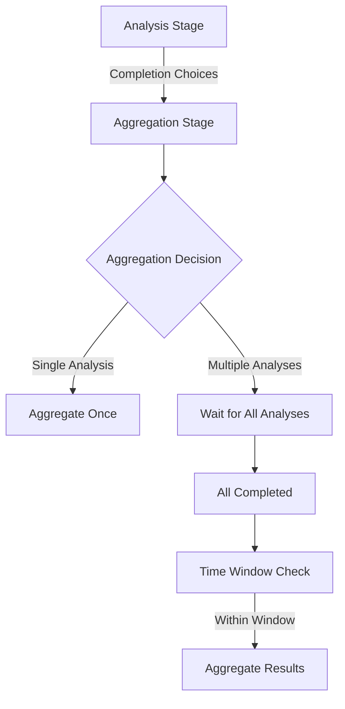

# Aggregations

Use this to tell the AI how to aggregate the results of your analysis chunks into a rolling aggregation window. If
aggregating on a single analysis, the aggregation cycle count sets how many base analysis cycles to aggregate on. If
aggregating on multiple analysis, it will aggregate whenever the the underlying analysis is run.

#### Diagram: Analysis->Aggregation Flow

## Text Aggregations

## JSON Aggregations

### Example Run: Analysis->Aggregation Flows

This shows an analysis stage feeding the aggregation stage. Notice how the Completion Choices output from the
analysis stage are then used in the aggregation stage as the prompt body, which is how the aggregation stages work.
By default it will use the last analysis stage in the workflow, relative to the aggregation stage, and
for multiple analysis stages it will aggregate once every analysis stage has completed at least once
and then aggregate all the results from the analysis stages that are within the time window since last aggregation.

### Start::End SQL Search Window

The start and end fields in the report are the generated SQL window query that the AI uses to aggregate the results
when fetching from a time series indexed datastore.

